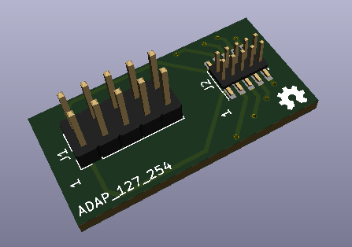

# Circuito impreso,  adaptador de conector 2x5 pines 1.27 mm macho a conector 2x5 pines  de 2.54 mm  macho

Esta tarjeta fue creada para convertir del "pequeñisimo" conector  de 1.27 mm que trae el  Programador-Depurador J-Link EDU Mini a un conector macho de 2.54 mm.

*Lea esto en otros idiomas: [English](../README.md)*

El programador J-Link EDU Mini viene con un conector de  2x5 pines  1.27 mm macho e incluye un cable cinta hembra a hembra de 2x5 pines 1.27mm para conectar al dispositivo que se programara.

Si por algun motivo el dispositivo a programar no usa el mismo tipo de conector (por ejemplo los pines de depuracion estan diseminados en diferentes partes del circuito impreso), o si se requiere conectar a un circuito en protoboard, esta tarjeta facilitara la tarea. 
## Como usar este repositorio

El circuito impreso fue desarrollado en KiCad V5.1, e incluye algunos elementos que un no han sido agregados al repositorio oficial de las bibliotecas de KiCad.  Para asegurar que el diseño puede ser editado tal cual como fue creado, todas las bibliotecas de KiCad han sido incluidas como submodulos de git, asi que para descargar dichos submodulos se debe clonar el repositorio con la opcion  _--recursive_  (se descargaran aproximadamente 5 GB !!).

Para configurar KiCad para que use las bibliotecas descargadas del repositorio en vez de usar las que vienen incluidas con el instalador, se recomienda leer el [siguiente articulo](https://forum.kicad.info/t/library-management-in-kicad-version-5/14636) el cual brinda ideas de como hacerlo.

## Estructura de directorios

* El directorio raiz contiene los archivos de  KiCad: proyecto, esquematico y circuito impreso.
* __library__  (submodulo git) contiene las bibliotecas de simbolos esquematicos.
* __modules__  (submodulo git) contiene las bibliotecas de footprints.
* __packages3d__ (submodulo git) contiene las bibliotecas de modelos 3D.
* __gerber/single__ contiene los archivos para fabricacion del circuito impreso, para una sola tarjeta.
* __gerber/panel_100mmx100mm__ contiene los archivos para fabricacion del circuito impreso, para multiples tarjetas que caben en un panel de  100mm x 100mm  (usando Vcuts!).
* __docs__ informacion adicional acerca del proyecto.

## Licencia

Este es un proyecto de Hardware Libre y esta licenciado bajo una licencia [Creative Commons Attribution 4.0 International License](http://creativecommons.org/licenses/by/4.0/).
